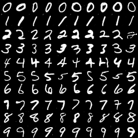
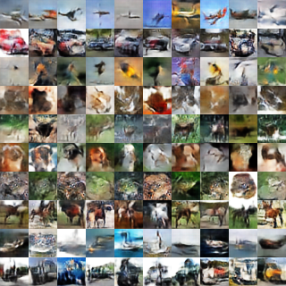
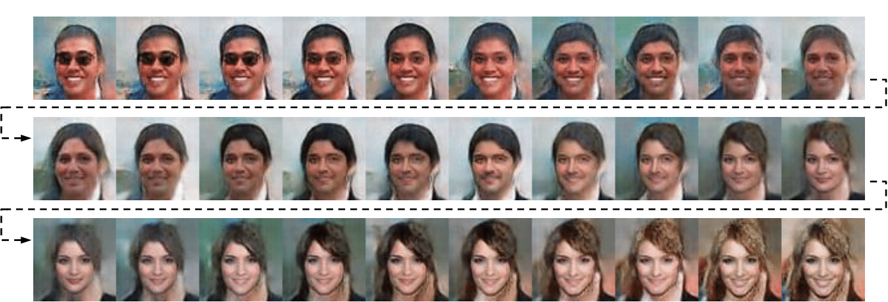

# SteinGAN
This repository contains the code for the paper [Learning to Draw Samples: With Application to Amortized MLE for Generative Adversarial Learning](https://arxiv.org/pdf/1611.01722.pdf).

The code is based on the excellent implementation of DCGAN (https://github.com/Newmu/dcgan_code).

## MNIST

MNIST images generated by SteinGAN.

## CIFAR-10
Results on CIFAR-10.

## CelebA

Results on CelebA. Upper: images generated by SteinGAN. Lower: images generated by SteinGAN when performing a random walk on the random input; we can see that a man with glasses and black hair gradually changes to a woman with blonde hair. 

## Feedback
Feedback is greatly appreciated. If you have any questions, comments, issues or anything else really, [shoot me an email](mailto:dilin.wang.gr@dartmouth.edu).

All rights reserved.

