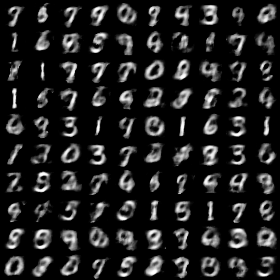
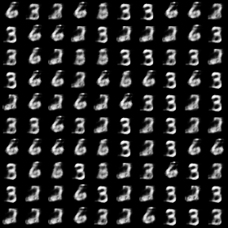
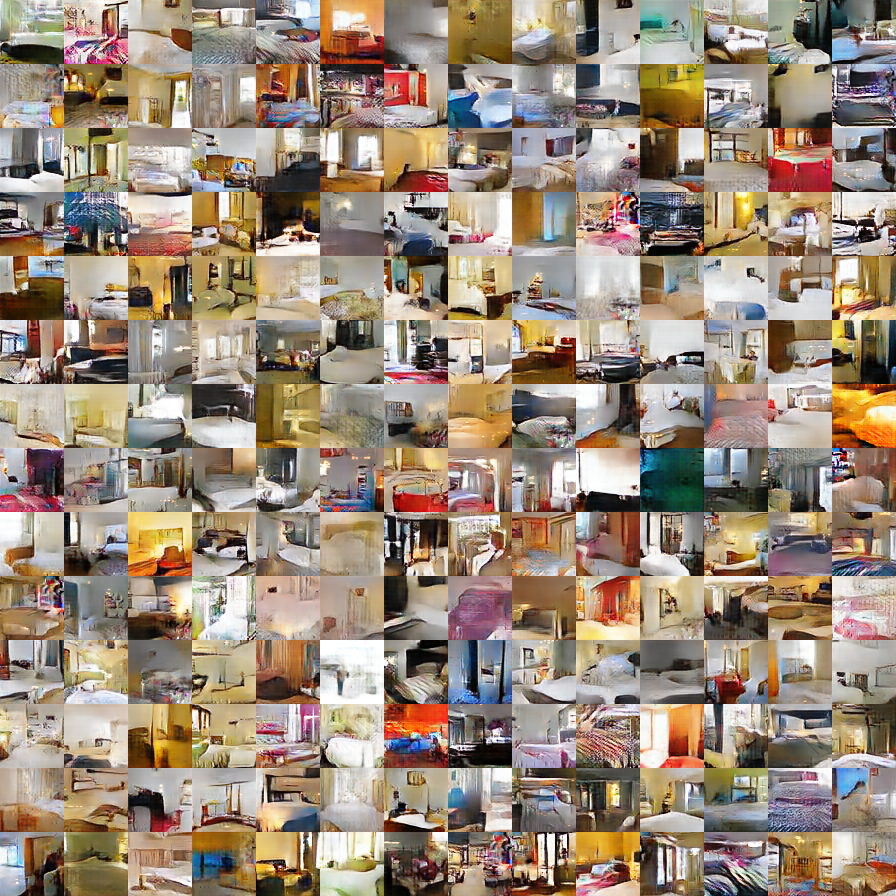

Please email [Dilin Wang](mailto:dilin@cs.utexas.edu) for the updated implementation.

# SteinGAN
This repository contains the code for the paper [Learning to Draw Samples: With Application to Amortized MLE for Generative Adversarial Learning](https://arxiv.org/pdf/1611.01722.pdf).

The code is based on the excellent implementation of [DCGAN](https://github.com/Newmu/dcgan_code).

## MNIST
We evaluate our methods on MNIST and
use a simple Gaussian-Bernoulli Restricted Boltzmann Machines
(RBM) as our energy-based model, which allows
us to accurately evaluate the test likelihood.
SteinGAN without the kernel
tends to produce much less diverse images. This suggests
that the repulsive term is responsible for generating diverse
images in SteinGAN.

We use the implementation of [Wu et al., 2017](https://github.com/tonywu95/eval_gen) to evaluate the test log-likelihood.

SteinGAN | SteinGAN without kernel
-------- | --------------------
TestLL: -771.2 | Test LL: -989.6 
-------- | --------------------
 | 

## CIFAR-10

Results on CIFAR-10. For more details, please refer to our paper.

## CelebA 64x64

CelebA images generated by SteinGAN.

## LSUN 64x64

## Citation
If you find SteinGAN helpful for your research, please cite the following papers:
* Dilin Wang and Qiang Liu. Learning to Draw Samples: With Application to Amortized MLE for Generative Adversarial Learning. arXiv preprint arXiv:1611.01722, 2016.
* Alec Radford, Luke Metz, Soumith Chintala. Unsupervised Representation Learning with Deep Convolutional Generative Adversarial Networks. arXiv preprint arXiv:1511.06434. 2015.

## Feedback
Feedback is greatly appreciated. If you have any questions, comments, issues or anything else really, [shoot us an email](mailto:dilin.wang.gr@dartmouth.edu).

All rights reserved.
