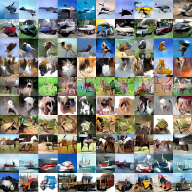

# SteinGAN
This repository contains the code for the paper [Learning to Draw Samples: With Application to Amortized MLE for Generative Adversarial Learning](https://arxiv.org/pdf/1611.01722.pdf).

The code is based on the excellent implementation of [DCGAN](https://github.com/Newmu/dcgan_code).

## MNIST
We evaluate our methods on MNIST and
use a simple Gaussian-Bernoulli Restricted Boltzmann Machines
(RBM) as our energy-based model, which allows
us to accurately evaluate the test likelihood.

As shown in Figure 1(d), SteinGAN without the kernel
tends to produce much less diverse images. This suggests
that the repulsive term is responsible for generating diverse
images in SteinGAN.
 |

MNIST images generated by SteinGAN.

## CIFAR-10

Results on CIFAR-10. For more details, please refer to our paper.

## CelebA

CelebA images generated by SteinGAN.

Images generated by SteinGAN when performing a random walk on the random input; we can see that a man with glasses and black hair gradually changes to a woman with blonde hair.

## Citation
If you find SteinGAN helpful for your research, please cite the following papers:
* Dilin Wang and Qiang Liu. Learning to Draw Samples: With Application to Amortized MLE for Generative Adversarial Learning. arXiv preprint arXiv:1611.01722, 2016.
* Alec Radford, Luke Metz, Soumith Chintala. Unsupervised Representation Learning with Deep Convolutional Generative Adversarial Networks. arXiv preprint arXiv:1511.06434. 2015.

## Feedback
Feedback is greatly appreciated. If you have any questions, comments, issues or anything else really, [shoot us an email](mailto:dilin.wang.gr@dartmouth.edu).

All rights reserved.
